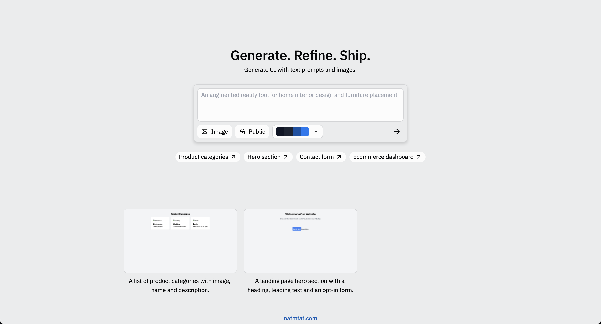
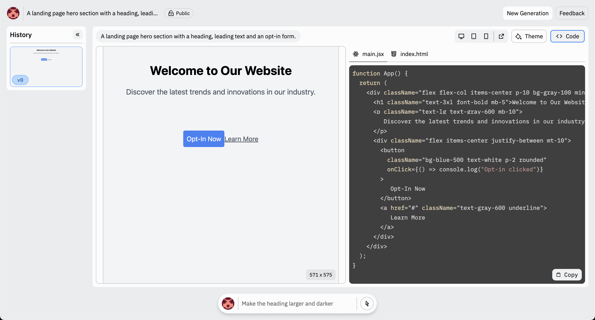

# v0

Generative UI. An (old) clone of Vercel's v0.

## Preview

<blockquote class="twitter-tweet" data-media-max-width="560">
I made a clone of <a href="https://twitter.com/v0?ref_src=twsrc%5Etfw">@v0</a> in the style of <a href="https://twitter.com/Replit?ref_src=twsrc%5Etfw">@Replit</a> (and then I realized v0 got a huge update and I&#39;m way to lazy to literally create an entirely new chat system right now) <a href="https://t.co/uoXXphrhDB">pic.twitter.com/uoXXphrhDB</a>
&mdash; Nathan (@natmfat) <a href="https://twitter.com/natmfat/status/1844842886560625028?ref_src=twsrc%5Etfw">October 11, 2024</a></blockquote>

## TODO

- [ ] color palettes
- [ ] image prompts
- [ ] selecting elements to update
